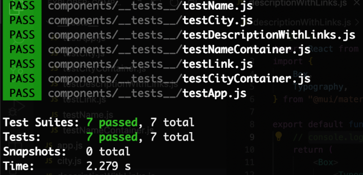
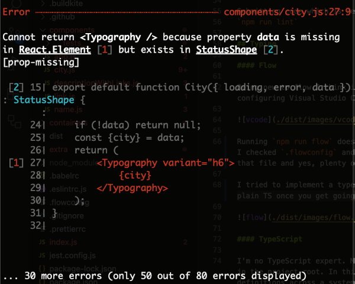

## Chirs Dorward, Oct 23rd 2023

 

Expected result is the following JSX renders as above on [localhost:8080](http://localhost:8080/). Expected to pass all CI checks; Lint, Jest, Prettify and (hopefully) Buildkite

```typescript
<DescriptionWithLinks
    description="My favourite website is www.mixcloud.com and my profile can be found at https://www.mixcloud.com/spartacus/  Find out more about the historical figure of Spartacus; https://en.wikipedia.org/wiki/Spartacus"
    links={[
        {
            url: 'www.mixcloud.com',
            text: 'Mixcloud!',
        },
        {
            url: 'https://www.mixcloud.com/spartacus/',
            text: 'Spartacus',
        },
        {
            url: 'https://en.wikipedia.org/wiki/Spartacus',
            text: 'Click Here',
        },
    ]}
/>
```

## DescriptionWithLinks 

Coding this was deceptively non-trivial. At first glance thinking "Just a bit of fancy string manipulation should do it" and then realising the extra complexity of mixing strings with components in the way the requirements specify. All approaches felt clumsy. There are [libs](https://github.com/iansinnott/react-string-replace) which would do the work for me, but there is also React's internal `renderToStaticMarkup()` which does what's needed. The function is more of a Node thing; usually used for doing Server Side Rendering, but it works in this context too. Jest requires some additional configuration in `setupTests.js` because it's running in NodeJS [setupTests.js](./setupTests.js)

```javascript
import { TextEncoder, TextDecoder } from 'util';
global.TextEncoder = TextEncoder;
global.TextDecoder = TextDecoder;
```

The finished component looks like this [descriptionWithLinks.js](./components/descriptionWithLinks.js)

```javascript
import { renderToStaticMarkup } from 'react-dom/server';
function DescriptionWithLinks({
    description,
    links
}: DescriptionWithLinksShape): Object {
    const replaceLinks = () => {
        let descriptionWithLinks = description;
        links.forEach(link => {
            const linkUrl = link.url;
            let u = linkUrl;
            if (u.substring(0, 8) !== 'https://') u = `https://${u}`;
            const linkText = link.text;
            const linkHTML = renderToStaticMarkup(<Link url={u}>{linkText}</Link>);
            descriptionWithLinks = descriptionWithLinks.replace(
                linkUrl,
                linkHTML
            );
        });
        return descriptionWithLinks;
    };
    return (
        <Typography variant="body2">
            <span dangerouslySetInnerHTML={{ __html: replaceLinks() }} />
        </Typography>
    );
}
```

#### RegExp variation

As an alternative to using substring/replace in a forEach loop, I considered using RegExp. I went back to the other approach because it seemed easier to read & understand

```javascript
links.forEach(link => {
    const regex = new RegExp(link.url, 'g');
    description = description.replace(
        regex,
        <Link target="_blank" url={link.url}>
            {link.text}
        </Link>
    );
});
```

## Refactoring Class components to Functional

> **Agile Story**: Convert all Class based React components to functional components, replacing any React lifecycle method calls with relevant React hooks. Please make sure the component is correctly Typed using flow

I was itching to do that. Strange how certain code patterns can suddenly look old. Not making the most of React hooks and more easily readable functional components seems like technical debt

## Tests & CI

#### Jest

With Jest setup, TDD is useful. New [**tests**](./components/__tests__) were quickly created from the existing pattern. These are not comprehensive, but do occasionally give me useful pointers when in watch mode 

`npm test` or `npm test:watch`



#### Lint

Submitting code which is required to lint properly makes me code better. Linting all the way through the development process teaches me a lot. I have to understand the errors to fix them and I see the benefits of that

`npm run lint:fix`

#### Buildkite

[Buildkite](https://buildkite.com/) looks like a better version of a process I had last year. Using Github Actions & Gatsby Cloud to trigger builds of Static Site Generated when the Headless CMS was updated. Plus I like anything which uses a YAML file. Yet Another Markup Language appeals to my sense of humour

## Typing

#### Flow 

```typescript
type DescriptionWithLinksShape = {
    description: string,
    links: Array<{
        text: string,
        url: string
    }>
};
```
Being new to flow I think it looks good. It seems easier than plain TS once you get going. My approach needs work (or just a better pattern to follow) & I assume that using the _Object_ type (which I have in places) is as bad form as using _any_ in TypeScript


`npm run flow` didn't generate any errors, which lead me to believe I was doing something wrong. I checked `.flowconfig` and realised it was set to ignore... everything. So I adjusted it. Plenty of errors.



#### TypeScript

I'm not a TypeScript expert. The value I see is collecting all definitions together so they can be used System wide. In this way all React components, Microservice Node apps, etc can use the same type definitions. An esoteric example of how I use TS is that I call types _Shapes_. It reminds me what they are and prevents variable name collision

### Design System

I use Design Systems a lot. Adding [Material UI](https://mui.com) here might seem overkill, but it's so quick & using it speeds things up so dramatically that I hope it's justified. Very similar StyledComponents, the theme can be configured here; `/theme/Theme.js`. I also enabled SCSS via webpack loader for an easy CSS/SCSS option when required. `/theme/style.scss`. The only dependencies I have added to the project 
`npm i @mui/material @emotion/react @emotion/styled && npm i css-loader sass sass-loader style-loader --save-dev`

---


[](https://listingslab.com/?mixcloud)
